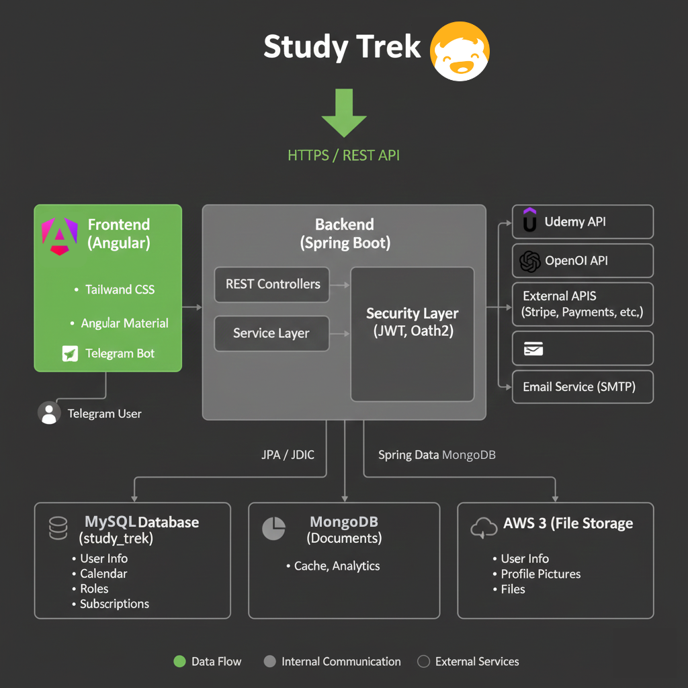

# Study Trek

<p align="left">
  
</p>

Study Trek è una piattaforma E-Learning progettata per aiutare gli utenti a gestire in modo efficiente il loro percorso di apprendimento. Sviluppato con Angular per il frontend e Spring Boot per il backend, offre una soluzione solida per la gestione di corsi su diverse piattaforme didattiche e materiali di studio. Promuove un approccio incentrato sulla comunità, consentendo agli utenti di aggiungere amici e di partecipare alle discussioni tramite un forum, promuovendo l'apprendimento collaborativo.

## Screenshots
<p align="left">
  
</p>
<p align="left">
  
</p>
<p align="left">
  
</p>
<p align="left">
  
</p>
<p align="left">
  
</p>
<p align="left">
  
</p>
<p align="left">
  
</p>
<p align="left">
  
</p>
<p align="left">
  
</p>

---
# Modifiche effettuate da Dannicchiarico10
## Architettura
<p align="left">
  
</p>

## Utilizzo e Installazione

### Prerequisiti
Assicurati che i seguenti strumenti siano installati sul tuo sistema:
- Java JDK 11+
- Maven
- Node.js & NPM (Versione LTS raccomandata)
- Angular CLI (npm install -g @angular/cli)
- Docker (Per i servizi database)
- MySQL (Server in esecuzione)
- MongoDB (Server in esecuzione)

---
### Backend Setup
#### Configurazione del Database (MySQL)
Prima di avviare il backend, devi configurare il database MySQL:
1. Assicurati che il tuo server MySQL sia in **esecuzione** su localhost:3306.
2. **Crea il Database**: Crea un database vuoto denominato study_trek.
3. **Inizializzazione Tabelle**: Esegui il file schema.sql (presente nella directory del backend) sul database study_trek per creare tutte le tabelle necessarie.

Nota: Le credenziali di connessione di default (newuser/123) sono definite in application.properties.

Inoltre, prima di eseguire il backend sarà necessario creare un file .env nella directory "backend":
```bash
# ====================================================================
# CONFIGURAZIONI API ESTERNE (Segreti)
# ====================================================================

# UDEMY
UDEMY_CLIENT_ID=il-tuo-client-id-udemy
UDEMY_CLIENT_SECRET=il-tuo-client-secret-udemy

# JWT (SICUREZZA)
JWT_SECRET_KEY=CHIAVE-SEGRETA-CASUALE

# OPENAI
OPENAI_API_KEY=la-tua-chiave-openai

# STRIPE
STRIPE_SECRET_KEY=sk_live_la-tua-chiave-live
STRIPE_SECRET_TEST=sk_test_la-tua-chiave-test

# AWS S3
AWS_S3_SECRET_KEY=Il-tuo-segreto-AWS
AWS_S3_ACCESS_KEY=La-tua-chiave-di-accesso-AWS

# TELEGRAM BOT
TELEGRAM_BOT_TOKEN=il-token-reale-del-bot
TELEGRAM_BOT_USERNAME=nome-utente-bot-reale

# ====================================================================
# CONFIGURAZIONI MAIL (Segreti)
# ====================================================================

SPRING_MAIL_USERNAME=tuonomeutente@example.com
SPRING_MAIL_PASSWORD=la-tua-password-smtp
```
Successivamente per eseguire il backend ci sono due modalità,
1. da terminale:
```bash
cd backend
mvn spring-boot:run
```
2. Oppure se si apre il progetto in un IDE, come IntelliJ-IDE eseguire:
```bash
BackendApplication
```

### Frontend Setup
Avvio del Frontend (Angular). Questa applicazione frontend è stata generata con Angular CLI e si connette al server backend (Spring Boot) in esecuzione sulla porta 8080.

#### Installazione delle Dipendenze:

1. Installa Angular CLI a livello globale (solo la prima volta):
```bash
npm install -g @angular/cli
```
2. Naviga nella directory del frontend:
```Bash
cd ...\study-trek\frontend
```
3. Installa le dipendenze del progetto:
```Bash
npm install
```
4. Avvio del Server di Sviluppo. Esegui il comando ng serve per avviare il server di sviluppo Angular.
```Bash
   ng serve
```
#### Accesso:
Una volta che la compilazione è completata, apri il tuo browser e naviga su:
```Bash
http://localhost:4200/
```
---
## Dettagli sulla Sicurezza e Sviluppo
- **Autenticazione and Autorizzazione**: Utilizza JWT per l'autenticazione e l'autorizzazione sicura per proteggere le sessioni utente e i dati sensibili. È stato disabilitato CSRF.
- **Data Encryption**: I dati sensibili degli utenti vengono crittografati tramite hashing (BCrypt) per garantire privacy e sicurezza.
- **CORS Stretto**: Accetta richieste solo dal frontend, come definito nelle modifiche in application.properties
- **Accesso agli Endpoint**: Solo i percorsi di autenticazione e al bot di telegram sono state lasciate accessibili a tutti, gli altri endpoint richiedono un utente autenticato e un token JWT valido.
- **Prevenzione da SQL Injection**: Tutte le interazioni con MySQL utilizzano Prepared Statements (Query Parametrizzate) tramite JdbcTemplate e Spring Data. La concatenazione di stringhe per la costruzione di query SQL è vietata.

---
## Modifiche

### In UserRepository:
Convertito l'import dei DB da TimeStamp a DateTime

### In Application.properties:

Sono state rimosse le chiavi placeholder in chiaro e inserite all'interno di un file
```Bash
.env
```
Aggiunte le configurazione del DB MySQL in locale:
```Bash
# --- MySQL ---
spring.datasource.url=jdbc:mysql://localhost:3306/study_trek?useSSL=false&allowPublicKeyRetrieval=true&useJDBCCompliantTimezoneShift=true
spring.datasource.username=newuser
spring.datasource.password=123
spring.datasource.driver-class-name=com.mysql.cj.jdbc.Driver
```
Fatto in modo che si accettino richieste solo dall'origine del frontend:
```Bash
app.cors.allowed-origin=http://localhost:4200
```
A livello di Endpoint ora 

### In SecurityConfig.java
È stato rimosso:
```Bash
/api/courses/**
``` 

Ora sono accessibili a tutti solo gli Endpoint delle Api:
- Auth per login e registrazione
- telegram per l'integrazione con il bot Telegram

Tutti gli altri endpoint richiedono un utente autenticato e un token valido.

Il controllo ora avviene nel Service Layer (Directory Services) prima di eseguire una qualsiasi operazione di scrittura o modifica nel DB. In ordine:
1. Il Service recupera l'ID dell'utente autenticato (il Principal) dal SecurityContextHolder.
2. Il Service recupera la risorsa (es. Nota, Evento) dal database.
3. Viene eseguito un confronto tra il userId della risorsa e l'ID dell'utente autenticato.

Aggiunta del Password Encoder tramite BCrypt:
```Bash
@Bean
public PasswordEncoder passwordEncoder() { return new BCryptPasswordEncoder(); }
```
### In SecurityTokenService.java
È stata configurata la durata del token JWT generato da un giorno ad un'ora:
```Bash
.withExpiresAt(now.plus(1, ChronoUnit.HOURS))
```
---

## Tecnologie Utilizzate
### Backend (Spring boot)
- **Linguaggio**: Java (JDK 11+)
- **Framework**: Spring Boot, Spring Security
- **Database**: MySQL (Relazionale), MongoDB (Documentale)
- **Gestione Progetto**: Maven

### Frontend (Angular)
- **Tailwind CSS**: [Visit Tailwind CSS](https://tailwindcss.com/)
- **Angular Material**: [Visit Angular Material](https://material.angular.io/)
- **DaisyUI**: [Visit DaisyUI](https://daisyui.com/)
- **Gestione Dipendenze**: NPM
- **Accesso**: http://localhost:4200/

### Image Credits
- Illustrations by Camilo Huinca: [Profile](https://agentpekka.com/artist/camilo-huinca/)
